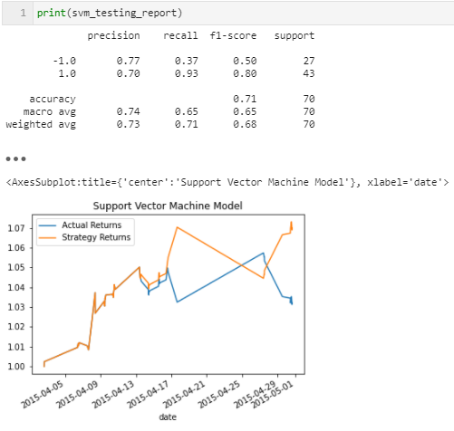
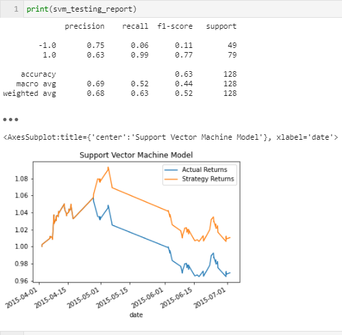
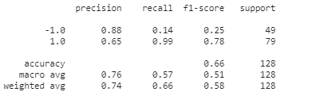
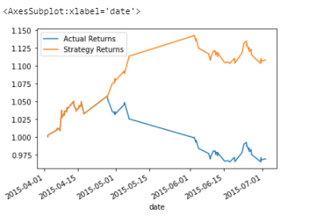

# ML_Trading_Bot

## Tuning the Baseline Trading Algorithm

---
### Tune the training algorithm by adjusting the size of the training dataset. 

To do so, slice your data into different periods. Rerun the notebook with the updated parameters, and record the results in this file `README.md`. 

* What impact resulted from increasing or decreasing the training window?
    - Answer : Limiting the training window by 1 month, the classification report result improves. The opposite is observed when the training window is increased. 
   
* What impact resulted from increasing or decreasing either or both of the SMA windows?
    - Answer : The classification report results improve by decreasing the short SMA to a lower number.
    

#### Choose the set of parameters that best improved the trading algorithm returns
    - 2 screenshots below illustrating the best scenarios results during the SVM algorith adjusting.
 
 

---

### Backtest the new model to evaluate its performance.
Logistic Regression model has been picked as a best performer over the original SVM model presented in the first part of the project.
Here are 2 screent illustrating the findings.

---

